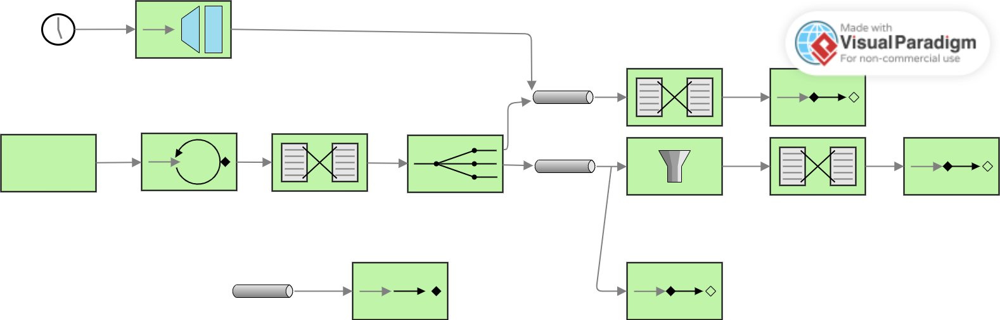

# Informe del Proyecto – Lab 5 Integración y SOA

## 1. Diagrama EIP (Antes)

El código inicial implementaba un sistema dirigido por mensajes que generaba números aleatorios y los enviaba hacia un flujo de procesamiento de pares u otro de impares. Sin embargo, presentaba problemas críticos que impedían el enrutamiento y procesamiento correcto. Los más relevantes estaban relacionados con canales faltantes, filtros incorrectos y tipos de canales inapropiados que provocaban pérdida o rechazo de mensajes.

---

## 2. Qué Estaba Mal

### **Bug 1: Falta del canal `numberChannel`**
El `numberChannel` no estaba definido en la configuración del flujo de integración. Como resultado, los números generados se enviaban directamente al router sin un punto intermedio. Esto hacía que el router no tuviera un canal de entrada adecuado y fallara especialmente al manejar números negativos.  
**Solución:** Crear un canal directo llamado `numberChannel` y configurar el generador de números para enviar todos los valores allí primero.

### **Bug 2: Filtro mal configurado en el flujo de impares**
El flujo de números impares contenía un filtro innecesario y excesivamente restrictivo que descartaba aproximadamente la mitad de los números impares válidos. El router ya garantizaba que solo números impares llegaran a ese flujo, por lo que el filtro no aportaba nada y solo causaba fallos.  
**Solución:** Eliminar completamente el filtro del flujo de impares.

### **Bug 3: Tipo de canal incorrecto para `oddChannel`**
El `oddChannel` no estaba configurado como un canal *publish-subscribe*. Esto causaba que, cuando varios suscriptores necesitaban recibir cada mensaje (el Odd Handler y el Odd Service), solo uno lo recibiera o se perdieran mensajes.  
**Solución:** Definir explícitamente `oddChannel` como canal *publish-subscribe* para permitir la difusión del mensaje a todos los suscriptores.

---

## 3. Lo Que Aprendí

En este laboratorio comprendí mejor los Enterprise Integration Patterns (EIP) y su implementación en Spring Integration con Kotlin. Aprendí cómo el tipo de canal afecta la distribución de mensajes: los canales directos permiten comunicación punto a punto, mientras que los publish-subscribe permiten difundir mensajes a múltiples consumidores simultáneamente.

También entendí la importancia de una arquitectura de canales bien diseñada, donde los canales intermedios organizan y separan etapas del flujo de procesamiento. Descubrí cómo funcionan routers, transformers y service activators, y por qué cada uno es fundamental en un sistema basado en mensajería.

Lo más desafiante fue rastrear dónde se perdían o rechazaban los mensajes. Resolví esto siguiendo el recorrido de cada mensaje paso por paso y revisando dónde existían canales faltantes o configuraciones incorrectas.

---

## 4. Declaración de Uso de IA

Sí, utilicé herramientas de IA (Claude) **solo para pequeños ajustes y para asegurar que el código cumpliera con requisitos de sintaxis de Kotlin**.

Realicé personalmente:

- La identificación de los tres bugs principales mediante pruebas y análisis del flujo de mensajes.
- El entendimiento profundo de por qué ocurría cada error.
- El diseño y corrección de los canales, filtros y flujos.
- Las pruebas finales verificando que el sistema procesaba correctamente números pares e impares.

Mi comprensión del sistema:  
Spring Integration usa canales como conductos entre componentes. Los routers dirigen mensajes, los transformers los modifican y los service activators ejecutan la lógica. Una arquitectura de canales bien definida es esencial porque incluso un error pequeño en la configuración puede provocar fallos en todo el sistema.

---

## Notas Adicionales

El bug del filtro de impares era especialmente sutil porque solo fallaba con la mitad de los números impares, lo que hacía difícil detectarlo al inicio. Esto me enseñó el valor de pruebas exhaustivas y de no confiar en resultados parcialmente correctos.

